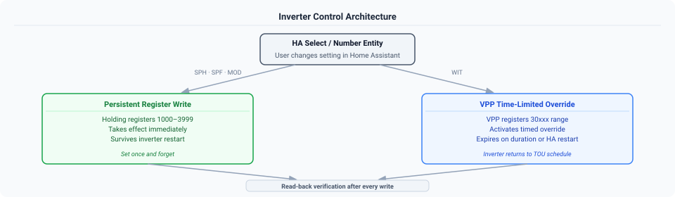

# Inverter Control Guide

This guide covers the battery and inverter control functionality available for each Growatt inverter model family. Not all models support the same controls — the method of control and available settings differ significantly between families.

---

## Control Architecture Overview

The integration exposes inverter control via standard Home Assistant **Select** and **Number** entities. Controls are automatically instantiated based on which holding registers are present in the active device profile — no manual configuration is required.

Two fundamentally different control models are used across the supported inverter families:



All writes use **read-back verification** — after writing, the integration reads the register back to confirm the value stuck. If a ShineWiFi dongle overwrites the value on the next poll cycle, a persistent notification is shown in the HA UI.

### Persistent Holding Register Writes (SPH, SPF, MOD)

- **How it works:** Write a value to a Modbus holding register. The setting takes effect immediately and persists until changed again — it survives inverter restarts.
- **When to use:** Changing operating mode, charge/discharge limits, AC charge enable. Set once and forget.
- **Risk level:** Low. Standard Modbus write to a well-documented register.

### VPP Time-Limited Overrides (WIT)

- **How it works:** Write a command to VPP protocol registers (30xxx range) that activates a time-limited battery override. The inverter returns to its base TOU schedule when the duration expires or HA restarts.
- **When to use:** Temporary battery force-charge (e.g., cheap tariff window), temporary discharge control.
- **Risk level:** Medium. Requires understanding of the VPP protocol. Rate limiting and conflict detection are built in.
- **See also:** [WIT Control Guide](wit-guide.md) for detailed VPP documentation.

---

## SPH Hybrid Inverters

**Applies to:** SPH 3000-6000TL-BH, SPH 7000-10000TL3-BH, SPH/SPM 8000-10000TL3-BH-HU

**Control method:** Persistent holding register writes (1000+ range)

**Control entities:**

| Entity | Type | Register | Options / Range | Description |
|--------|------|----------|-----------------|-------------|
| Priority Mode | Select | 1044 | Load First (0), Battery First (1), Grid First (2) | Sets the primary power source priority |
| AC Charge Enable | Select | 1092 | Disabled (0), Enabled (1) | Allows/prevents charging from grid |
| Discharge Power Rate | Number | 1070 | 0–100 % | Maximum battery discharge power rate |
| Discharge Stop SOC | Number | 1071 | 0–100 % | SOC level at which discharge stops |
| Charge Power Rate | Number | 1090 | 0–100 % | Maximum battery charge power rate |
| Charge Stop SOC | Number | 1091 | 0–100 % | SOC level at which charging stops |
| System Enable | Select | 1008 | Disabled (0), Enabled (1) | System enable control (HU models only) |
| Battery First Period 1 Start | Time | 1100 | HH:MM | Charge schedule slot 1 start |
| Battery First Period 1 End | Time | 1101 | HH:MM | Charge schedule slot 1 end |
| Battery First Period 1 Enable | Select | 1102 | Disabled (0), Enabled (1) | Enable charge slot 1 |
| Battery First Period 2/3 | Time / Select | 1103-1108 | as above | Charge schedule slots 2 and 3 |
| Grid First Period 1 Start | Time | 1080 | HH:MM | Discharge/export schedule slot 1 start |
| Grid First Period 1 End | Time | 1081 | HH:MM | Discharge/export schedule slot 1 end |
| Grid First Period 1 Enable | Select | 1082 | Disabled (0), Enabled (1) | Enable discharge slot 1 |
| Grid First Period 2/3 | Time / Select | 1083-1088 | as above | Discharge schedule slots 2 and 3 |
| Battery First / Grid First 4-6 | Time / Select | 1017-1034 | as above | Extra slots - see the note below |

**Two independent schedules.** Battery First (1100-1108) is the charge schedule and Grid
First (1080-1088) is the discharge/export schedule. They run concurrently and do not
conflict - confirmed on an SPH 3600 running one of each simultaneously for several hours
([#386](https://github.com/0xAHA/Growatt_ModbusTCP/issues/386)).

The slot numbers shown match the Growatt app and Protocol V1.39. The underlying entity IDs
use an older numbering (`grid_first_time_period_7/8/9` for Grid First 1-3, `time_period_*`
for Battery First), which is kept so existing automations continue to work.

**Slots 4-6 (registers 1017-1034) are documented but may not be implemented on your
firmware.** They are mapped because the protocol defines them, but at least one SPH 3600
(RAAA191904/ZCBA-0004) accepts the write and immediately reverts the register. If yours does
that, disable the entities - other firmware may well support them.

### Verifying PV Energy Total

`PV Energy Total` comes from registers 91/92 and is meant to be lifetime **DC** harvest. On
most hardware it is: measurements from WIT, MOD, MID and an SPH all agree with the sum of
their own per-string counters to within a fraction of a percent.

**On one SPH 3600 it did not.** It read 23,184.7 kWh where PV1 + PV2 totalled 19,597.9 —
about 18% high — and sat within 91 kWh of that unit's AC `Energy Total`, i.e. it was tracking
AC generation rather than DC harvest. A second SPH 3600 of the same model, on the same
integration version, behaved normally. So the difference is per unit, most likely firmware,
and there is nothing in the protocol that declares which convention a given inverter follows
([#381](https://github.com/0xAHA/Growatt_ModbusTCP/issues/381)).

To check your own, enable **PV1 Energy Total** and **PV2 Energy Total** — they are
disabled by default, under `+N entities not shown` on the device page — and compare:

| Result | Meaning |
|---|---|
| Per-string sum ≈ PV Energy Total | Normal. Either figure is your DC harvest |
| PV Energy Total well above the sum, and close to Energy Total | Your unit reports AC there. **Use the per-string sum** and hide PV Energy Total |

The per-string counters matched both units' own Growatt app figures exactly, so they are the
reliable measure when the two disagree.

### Energy sensors worth distinguishing

Three lifetime counters look similar and mean different things:

| Sensor | Registers | Measures |
|---|---|---|
| Battery Charge Total | 1058/1059 | **All** energy into the battery — PV and grid |
| AC Charge Energy Total | 114/115 | Grid→battery only |
| Battery Discharge Total | 1054/1055 | All energy out of the battery |

So AC Charge Energy Total is normally *lower* than Battery Charge Total; the difference is
what came from your panels. On one reporter's system the figures were 7,099.8 kWh against
13,820.8 kWh.

Registers 112–115 carry AC charge energy on SPH because it is a "Storage Power" model. The
same addresses hold warning and fault codes on MAX-class string inverters — the protocol
lists both meanings side by side, selected by device class.

> **There is no AC Discharge Energy Total on SPH.** Protocol V1.39 defines no AC-discharge
> counter at all; only off-grid models (SPF, SPE) have one. If you had this entity before
> v1.7.6 it was never populated by a register, and any value it showed was a stale artefact.
> It is removed automatically on upgrade. Use **Battery Discharge Total** instead.

**Notes:**
- All SPH variants share the same 1000+ register range — controls apply across 3–6kW, 7–10kW, and HU variants automatically.
- Time periods use HHMM format: `530` = 05:30, `2300` = 23:00.
- Controls are polled on every coordinator update and reflected in Home Assistant state without restart.

---

## SPF Off-Grid Inverters

**Applies to:** SPF 3000-6000 ES PLUS

**Control method:** Persistent holding register writes (0–97 range)

**Control entities:**

| Entity | Type | Register | Options / Range | Description |
|--------|------|----------|-----------------|-------------|
| Output Priority | Select | 1 | SBU (0), SOL (1), UTI (2), SUB (3) | Output source priority |
| Charge Priority | Select | 2 | CSO (0), SNU (1), OSO (2) | Battery charge source priority |
| AC Input Mode | Select | 8 | APL (0), UPS (1), GEN (2) | AC input mode (appliance / UPS / generator) |
| Battery Type | Select | 39 | AGM (0), FLD (1), User (2), Lithium (3), User 2 (4) | Battery chemistry (⚠️ set with caution) |
| Max Charge Current | Number | 34 | 10–100 A | **Total** charging current, solar + utility combined (LCD Program 02) |
| Bulk Charge Voltage | Number | 35 | 48.0–58.4 V | C.V. charging voltage (LCD Program 19). Disabled by default |
| Float Charge Voltage | Number | 36 | 48.0–58.4 V | Floating charging voltage (LCD Program 20). Disabled by default |
| AC Charge Current | Number | 38 | 0–80 A | Max charging current from AC/grid (LCD Program 11) |
| Generator Charge Current | Number | 83 | 0–80 A | Max charging current from generator |
| Battery to Utility SOC | Number | 37 | 0–100 % (Lithium) / 20–64 V (Lead-acid) | SOC/voltage to switch from battery to utility |
| Utility to Battery SOC | Number | 95 | 0–100 % (Lithium) / 20–64 V (Lead-acid) | SOC/voltage to switch back from utility to battery |

**Output Priority options:**
- `SBU` — Solar → Battery → Utility (battery-first, self-consumption focused)
- `SOL` — Solar → Utility → Battery (solar-first, grid backup)
- `UTI` — Utility → Solar → Battery (grid-first, battery preserved)
- `SUB` — Solar & Utility → Battery (combined source charging)

**Charge Priority options:**
- `CSO` — Solar first, grid only when solar insufficient
- `SNU` — Solar and grid simultaneously
- `OSO` — Solar only, no grid charging

**Max Charge Current vs AC Charge Current.** Max Charge Current (34) is the *total* across
both chargers — solar plus utility. AC Charge Current (38) limits only the utility side. If
you set the total below the AC limit, the inverter applies the total to the utility charger
as well, so 34 can quietly override 38.

**Bulk and Float Charge Voltage are disabled by default, and only work on a self-defined
battery type.** These are the only controls in this integration where a wrong value affects
hardware rather than a reading: the inverter rejects anything outside 48.0-58.4 V, but an
in-range value that is wrong for your battery chemistry will be accepted and applied. They
are created disabled so enabling them is a deliberate step - **Settings > Devices & Services
> Growatt Modbus > entities**, then enable the one you want.

Both correspond to LCD Programs 19 and 20, which the manual marks as settable only when
Program 5 (battery type) is a self-defined option. The entities are therefore unavailable on
AGM, Flooded and Lithium. The integration reads your existing values and never writes a
default - a value changes only when you move the control
([#384](https://github.com/0xAHA/Growatt_ModbusTCP/issues/384)).

**Max Charge Current is unavailable when Battery Type is Lithium.** The inverter does not
allow it to be set in that mode — the BMS takes over charge current control — so the entity
is withheld rather than offered and ignored. Range and behaviour are confirmed on an
SPF 6000ES Plus; smaller units in this family accept a lower maximum, and a value above
what your model allows will be rejected by the inverter and the entity will revert
([#376](https://github.com/0xAHA/Growatt_ModbusTCP/issues/376)).

**Notes:**
- SPF is an off-grid inverter — there is no grid export. The grid is treated as an AC input source for charging/backup.
- `battery_type` (register 39) controls charging voltage thresholds. Changing this incorrectly can damage batteries. Verify your battery chemistry before writing.
- `bat_low_to_uti` and `ac_to_bat_volt` operate in different units depending on battery type: percentage (0–100%) for Lithium, voltage (20.0–64.0V) for lead-acid types.

---

## WIT Commercial Hybrid Inverters

**Applies to:** WIT 4000-15000TL3-X

**Control method:** VPP time-limited protocol (30xxx registers + legacy 2xx registers)

**Control entities:**

| Entity | Type | Register | Options / Range | Description |
|--------|------|----------|-----------------|-------------|
| Work Mode | Select | 202 | Standby (0), Charge (1), Discharge (2) | Remote battery command mode |
| Active Power Rate | Number | 201 | 0–100 % | Power level for charge/discharge command |
| Export Limit | Number | 203 | 0–20000 W | Export limit in watts (0 = zero export) |
| Control Authority | Select | 30100 | Disabled (0), Enabled (1) | VPP master enable switch |
| VPP Export Limit Enable | Select | 30200 | Disabled (0), Enabled (1) | Enable VPP export limitation |
| VPP Export Limit Rate | Number | 30201 | -100–+100 % | Export power rate (positive=export, 0=zero export) |
| Remote Power Control | Select | 30407 | Disabled (0), Enabled (1) | Enable timed charge/discharge override |
| Remote Control Duration | Number | 30408 | 0–1440 min | Duration for remote power control override |
| Remote Charge/Discharge Power | Number | 30409 | -100–+100 % | Power level (negative=discharge, positive=charge) |

**Important notes:**
- WIT uses a **time-limited override** model. Commands via registers 30407–30409 expire after the configured duration or when HA restarts. The inverter then returns to its TOU schedule default.
- Register 30476 (`priority_mode`) on WIT shows the base TOU mode. Writability **varies by model** - it was documented as read-only, but has been written successfully for months on a WIT 8000TL3-HU ([#353](https://github.com/0xAHA/Growatt_ModbusTCP/issues/353)). The TOU Default Mode control writes it; if your model rejects the write, use the inverter display or Growatt app instead.
- Rate limiting is built in to prevent command flooding.
- Conflict detection prevents simultaneous charge + discharge commands.

See [WIT Control Guide](wit-guide.md) for full protocol documentation.

---

## MOD Three-Phase Hybrid Inverters

**Applies to:** MOD 6000-15000TL3-XH and MID 11000-30000TL3-XH (VPP V2.01, DTC 5400)

**Control method:** Persistent writes to the 3000-range GEN4 registers.

### Controls

| Entity | Type | Register | Options / Range | Description |
|--------|------|----------|-----------------|-------------|
| Allow Grid Charge | Select | 3049 | Disabled (0), Enabled (1) | Permits charging from the grid. Must be Enabled for time-of-use writes to persist |
| Charge Power Rate | Number | 3047 | 1–100 % | Battery charge power limit |
| Charge Stopped SOC | Number | 3048 | 0–100 % | SOC at which charging stops, from any source |
| Discharge Power Rate | Number | 3036 | 0–100 % | Battery discharge power limit |
| Discharge Stopped SOC | Number | 3067 | 1–100 % | SOC at which discharging stops |
| Grid Charge Stopped SOC | Number | 3312 | 0–100 % | SOC at which charging **from the grid** stops. See below |
| Time Period 1–9 Priority | Select | 3038–3058 | Load / Battery / Grid First | Priority for each time-of-use slot |
| Time Period 1–9 Enable | Select | 3038–3058 | Disabled, Enabled | Enable each slot |
| Time Period 1–9 Start / End | Time | 3038–3059 | 00:00–23:59 | Slot start and end times |

!!! warning "Two charge-stop settings, and they are not the same"
    **Charge Stopped SOC** (3048) applies to charging from any source. **Grid Charge
    Stopped SOC** (3312) applies only to charging from the grid, and the lower of the two
    wins.

    This catches people out. On one system 3312 sat at 55 % while 3048 was 100 %, silently
    capping grid charging for two days ([#372](https://github.com/0xAHA/Growatt_ModbusTCP/issues/372)).
    Growatt exposes 3312 in neither the ShinePhone app nor the web portal, so if grid
    charging stops short of your configured limit, check this entity.

!!! info "Registers 1090 and 1092 are not available on this hardware"
    Earlier versions offered **Charge Power Rate (1090)** and **AC Charge Enable (1092)**
    on MOD. The entire holding block 1000–1124 is unimplemented on this family — a full
    sweep read zero across all 125 registers, and writes are rejected outright with Modbus
    exception 2 ([#371](https://github.com/0xAHA/Growatt_ModbusTCP/issues/371)).

    Both were removed. Use **Charge Power Rate (3047)** and **Allow Grid Charge (3049)**
    instead; both are confirmed working. If you had automations pointing at the old
    entities, they will have been removed on upgrade.

### Peak shaving and demand management (read-only)

These are configured in the Growatt web portal and shown here for visibility. They are
diagnostic entities, and appear in no public Growatt protocol document — the mappings were
established by changing each value in the portal and reading the register back
([#372](https://github.com/0xAHA/Growatt_ModbusTCP/issues/372)).

| Entity | Register | Description |
|--------|----------|-------------|
| Import Limit | 3307 | Demand-management import ceiling (kW) |
| Export Limit | 3308 | Demand-management export ceiling (kW) |
| Peak Shaving Reserve SOC | 3310 | Charge held back for peak shaving (%) |
| AC Charge Max Power | 3311 | Ceiling on grid charging power (kW) |

**These report what peak shaving is configured to use, not whether it is running.** On the
unit these mappings came from, Peak Shaving Enable reads *Disable* while all five registers
hold plausible configured values. A populated cluster therefore says the settings exist, not
that the feature is in force
([#372](https://github.com/0xAHA/Growatt_ModbusTCP/issues/372)).

**These also apply to MID.** The MID 11-30KTL3-XH profile loads the same register map, so
the entities appear there too — the profile name does not tell you which family a register
cluster reaches.

**The three kW limits are unavailable until peak shaving has been configured.** When the
feature has never been set up, those registers hold a ceiling rather than a zero — 30000 or
65535, which would render as 3000 kW and 6553.5 kW. The integration publishes nothing
instead, so an unavailable entity here means "not configured in the portal", not a
communication problem
([#380](https://github.com/0xAHA/Growatt_ModbusTCP/issues/380)).

Reserve SOC is the exception and is always shown. An SOC has no implausible ceiling to
give it away — 50 % reads identically whether you set it or the factory did — so there is
no way to tell configured from unset, and guessing would be worse than showing the value.

### VPP remote power control (read-only)

MOD TL3-XH **does** support VPP remote power control — this was measured on hardware
([#373](https://github.com/0xAHA/Growatt_ModbusTCP/issues/373)) — but the controls are not
exposed for writing yet. The state is available as disabled-by-default diagnostic entities:
VPP Control Authority (30100), VPP Remote Power Control (30407), VPP Commanded Power
(30409) and VPP Last Setpoint (30474).

!!! danger "Why writing is not exposed"
    **The commanded power is a target, not a limit.** At 100 % with insufficient solar, the
    inverter climbed toward the setpoint and drew 912 W from the grid — while Allow Grid
    Charge was Disabled. At lower percentages only downward limiting is visible, which
    makes it look like a cap.

    **The duration expires but the registers do not clear.** After a 2-minute command the
    power constraint released at ~128 s while all three registers stayed set for the full
    observation. You cannot tell from these values whether control is currently active.

    Writable controls need a guard against commanding more power than solar can supply.
    Until that exists, exposing them would let an automation import from the grid while the
    user believes grid charging is switched off.

**Battery monitoring sensors available:**

| Sensor | Register | Description |
|--------|----------|-------------|
| Battery SOC | 3171 | State of charge (%) |
| Battery SOH | 1096 | State of health (%) |
| Battery Voltage | 3169 | Battery voltage (×0.01 V) |
| Battery Current | 3170 | Battery current (×0.1 A) |
| DC-DC Temperature | 3176 | Battery-side DC-DC stage temperature (×0.1 °C). Not the pack temperature — see [#362](https://github.com/0xAHA/Growatt_ModbusTCP/issues/362) |
| Battery Charge Power | 3178/3179 | Charge power (×0.1 W) |
| Battery Discharge Power | 3180/3181 | Discharge power (×0.1 W) |
| Battery Charge Today | 3129/3130 | Energy charged today (kWh) |
| Battery Discharge Today | 3125/3126 | Energy discharged today (kWh) |
| Battery Charge Total | 3131/3132 | Lifetime charge energy (kWh) |
| Battery Discharge Total | 3127/3128 | Lifetime discharge energy (kWh) |
| AC Charge Energy Today | 3133/3134 | Grid→battery energy today (kWh) |
| AC Charge Energy Total | 3135/3136 | Grid→battery lifetime energy (kWh) |

---

## MIN / MIN TL-XH Grid-Tied Inverters

**Applies to:** MIN 3000-6000TL-X, MIN 7000-10000TL-X, MIN TL-XH 3000-10000 V2.01

**Control:** No battery control available. These are grid-tied inverters without battery management registers.

**Available controls:** None beyond the universal `on_off` (register 0) and `active_power_rate` (register 3) which are present on all models but not exposed as control entities by default.

---

## MIC Micro Inverters

**Applies to:** MIC 600-3300TL-X

**Control:** None. MIC is a grid-tied micro inverter with no battery or control registers beyond basic inverter status.

---

## Summary Table

| Model Family | Battery Control | Control Method | Select Entities | Number Entities |
|---|---|---|---|---|
| **SPH** (3–10kW) | Yes | Persistent writes | Priority Mode, AC Charge Enable, Time Period Enables (×3), System Enable (HU) | Discharge Rate, Discharge Stop SOC, Charge Rate, Charge Stop SOC, Time Period Start/End (×3) |
| **SPF** ES PLUS | Yes | Persistent writes | Output Priority, Charge Priority, AC Input Mode, Battery Type | Max Charge Current, AC Charge Current, Gen Charge Current, Battery→Utility SOC, Utility→Battery SOC |
| **WIT** (4–15kW) | Yes (timed) | VPP overrides | Work Mode, Control Authority, VPP Export Limit Enable, Remote Power Control | Active Power Rate, Export Limit, VPP Export Rate, Remote Duration, Remote Power |
| **MOD / MID** TL3-XH | Yes | Persistent writes | Allow Grid Charge, Time Period Priority/Enable (×9) | Charge Rate, Charge Stop SOC, Grid Charge Stop SOC, Discharge Rate, Discharge Stop SOC, Time Period Start/End (×9) |
| **MIN / TL-XH** | No | — | — | — |
| **MIC** | No | — | — | — |

---

## Keeping the inverter's clock accurate

Time period schedules run against the **inverter's own clock**, not Home Assistant's. That
clock drifts — one SPH was two minutes out, which made a 13:00 export window start at 13:02.

Two entities cover it, both on the **inverter** device under **Diagnostic**, and both
**disabled by default** — enable them in the entity settings if you want them:

| Entity | What it does |
|---|---|
| `sensor.<name>_inverter_clock` | The inverter's own clock as readable local time, e.g. `2026-08-26 14:32:05` |
| `button.<name>_inverter_clock_sync` | Sets the inverter's clock from Home Assistant's, on press |

They are off by default for different reasons. The sensor costs one extra register read on
every poll, which is not free on a gateway that needs small blocks — nothing is read at all
until you enable it. The button writes six holding registers per press, and those are very
likely EEPROM-backed with a finite write budget
([#392](https://github.com/0xAHA/Growatt_ModbusTCP/issues/392)), so it is not something to
leave where it can be pressed absent-mindedly.

Neither appears on off-grid (SPF/SPE) profiles, which encode the clock differently.

The state is formatted wall-clock text rather than a Home Assistant timestamp, because a
timestamp sensor renders as relative time ("12 seconds ago", ticking) and is unreadable as
a clock. Three attributes carry the machine-readable side:

| Attribute | |
|---|---|
| `timestamp` | ISO 8601, timezone-aware - use this in templates |
| `drift_seconds` | Positive means the inverter is ahead of Home Assistant |
| `drift_minutes` | The same, rounded to one decimal |

So a drift alert is straightforward:

```yaml
automation:
  - alias: "Growatt - warn on inverter clock drift"
    triggers:
      - trigger: numeric_state
        entity_id: sensor.growatt_inverter_clock
        attribute: drift_minutes
        above: 5
    actions:
      - action: notify.persistent_notification
        data:
          message: "The inverter clock has drifted; schedules will fire late."
```

For a scheduled sync, or to act on the drift the write corrected, use the action instead —
it takes a `min_drift_seconds` threshold and returns what it found. See
**[Actions Reference → Sync the inverter clock](actions.md#sync-the-inverter-clock)**.

---

## Adding Control Entities to Automations

All control entities follow standard Home Assistant naming. Examples:

```yaml
# Force battery to charge at 80% power for 60 minutes (WIT)
- service: number.set_value
  target:
    entity_id: number.growatt_remote_charge_and_discharge_power
  data:
    value: 80
- service: number.set_value
  target:
    entity_id: number.growatt_remote_power_control_charging_time
  data:
    value: 60
- service: select.select_option
  target:
    entity_id: select.growatt_remote_power_control
  data:
    option: "Enabled"

# Set SPH to Battery First mode (SPH)
- service: select.select_option
  target:
    entity_id: select.growatt_priority_mode
  data:
    option: "Battery First"

# Enable AC charging on SPH
- service: select.select_option
  target:
    entity_id: select.growatt_ac_charge_enable
  data:
    option: "Enabled"
```

---

## Energy Dashboard Setup

The integration pre-configures all energy sensors with the correct `state_class` and `device_class` for the HA Energy Dashboard. Recommended sensor mapping:

| Dashboard slot | Sensor |
| --- | --- |
| Solar production | `sensor.{name}_energy_total` |
| Return to grid | `sensor.{name}_energy_to_grid_today` *(use total variant)* |
| Grid consumption | `sensor.{name}_energy_to_user_today` *(use total variant)* |
| Individual consumption | `sensor.{name}_load_energy_today` *(use total variant)* |
| Battery in | `sensor.{name}_charge_energy_today` *(use total variant)* |
| Battery out | `sensor.{name}_discharge_energy_today` *(use total variant)* |

> If `Grid Export Power` and `Grid Import Power` appear swapped after upgrading to v0.9.1b1, disable **Invert Grid Power** in the integration options (Settings → Devices & Services → Growatt Modbus → Configure) — it was incorrectly enabled by the setup wizard's auto-detection in previous versions. Most users should have this option off. If the signed `Grid Power` sensor shows the wrong sign independently, run the `detect_grid_orientation` service.

---

## Contributing

If you have a MOD inverter with APX battery (Issue #131) and can provide holding register scans from the 1000–1124 range, please share your findings in the issue. This will enable battery control for the MOD family.

For other model-specific control questions, [open an issue](https://github.com/0xAHA/Growatt_ModbusTCP/issues) with your model, DTC code, and a register scan from the diagnostic tool.
