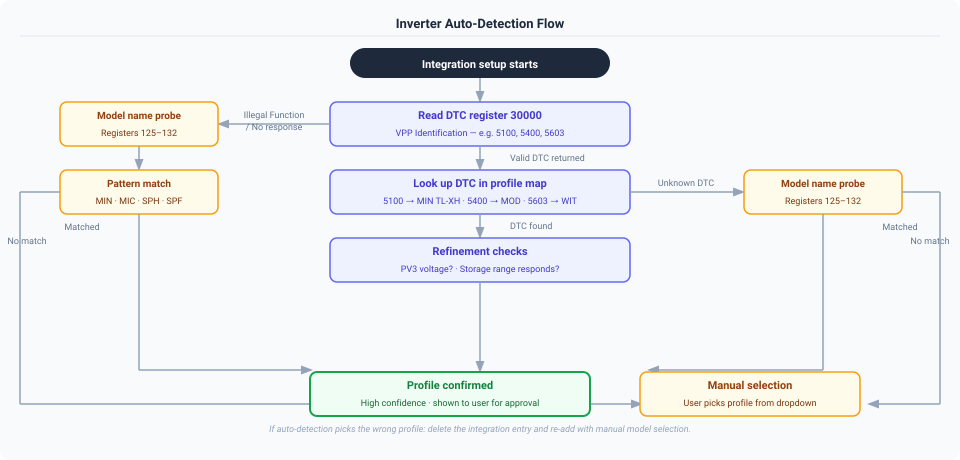

# Supported Models and Sensor Availability

---

## How Auto-Detection Works

When you add the integration, it attempts to identify your inverter automatically before asking you to choose a profile.



**Key points:**

- VPP-capable inverters (DTC present) are identified with high confidence
- Legacy inverters (no DTC) use model name probing — works for MIN, MIC, SPH families
- If auto-detection picks the wrong profile, delete and re-add the integration with manual selection
- The Universal Register Scanner (Developer Tools → Actions) shows the detection reasoning in its output

---

## Supported Models

### Single-Phase Grid-Tied

| Model | Range | PV Strings | VPP Support | Auto-detect | Tested | Notes |
|-------|-------|-----------|-------------|-------------|--------|-------|
| **MIC 600-3300TL-X** | 0.6–3.3 kW | 1 | Legacy only | Model name | ✅ | Micro inverter |
| **MIN 3000-6000TL-X** | 3–6 kW | 2 | VPP + Legacy | Model name | ✅ | |
| **MIN 7000-10000TL-X** | 7–10 kW | 3 | VPP + Legacy | Model name | ✅ | |

### Single-Phase Hybrid (with Battery)

| Model | Range | PV Strings | VPP Support | Auto-detect | Tested | Notes |
|-------|-------|-----------|-------------|-------------|--------|-------|
| **MIN TL-XH 3000-10000** | 3–10 kW | 2–3 | VPP | DTC 5100 | ✅ | 3–6kW: 2 strings; 7–10kW: 3 strings |
| **SPA 3000-6000TL BL** | 3–6 kW | None | Legacy only | Auto | ✅ | AC-coupled storage only — no PV DC inputs |
| **SPE 8000-12000 ES** | 8–12 kW | 2 | VPP-like | Model name | ✅ | Peak shaving, parallel operation |
| **SPH 3000-6000** | 3–6 kW | 2 | VPP + Legacy | Model name | ✅ | |
| **SPH 7000-10000** | 7–10 kW | 2 | VPP + Legacy | Model name | ✅ | |
| **SPH/SPM 8000-10000 HU** | 8–10 kW | 3 | VPP + Legacy | DTC | ⚠️ | BMS monitoring (SOH, cell voltages) |

### Single-Phase Off-Grid

| Model | Range | PV Strings | VPP Support | Auto-detect | Tested | Notes |
|-------|-------|-----------|-------------|-------------|--------|-------|
| **SPF 3000-6000 ES PLUS** | 3–6 kW | 2 | Off-grid protocol | Manual | ✅ | No grid export; grid = AC input only |

### Three-Phase

| Model | Range | PV Strings | Battery | VPP Support | Auto-detect | Tested | Notes |
|-------|-------|-----------|---------|-------------|-------------|--------|-------|
| **MID 15000-25000TL3-X** | 15–25 kW | 2 | No | VPP + Legacy | Model name | ⚠️ | Grid-tied |
| **MOD 6000-15000TL3-X** | 6–15 kW | 3 | No | VPP + Legacy | DTC 5400 | ⚠️ | Grid-tied; grid flow sensors require Growatt smart meter (GOSS-W / SPM-S) |
| **MOD 6000-15000TL3-XH** | 6–15 kW | 3 | Yes | VPP + Legacy | DTC 5400 | ✅ | Battery monitoring only (control pending) |
| **SPA-TL3 4000-10000** | 4–10 kW | None | Yes | VPP + Legacy | DTC 3725 | ✅ | AC-coupled storage only — no PV DC inputs. Shares the SPH-TL3 register map |
| **SPH-TL3 3000-10000** | 3–10 kW | 2 | Yes | VPP + Legacy | DTC | ✅ | Tested: SPH 8000TL3 BH-UP |
| **WIT 4000-15000TL3** | 4–15 kW | 2 | Yes | VPP v2.03 | DTC 5603 | ✅ | Advanced VPP control — DTC 5603 hardware-confirmed (Issue #335) |

**Legend:** ✅ Tested with real hardware · ⚠️ Profile from documentation, community validation welcome

> **VPP Protocol:** Growatt's Virtual Power Plant Protocol (registers 30000+) enables advanced monitoring and control, and allows automatic model identification via Device Type Code. Models with "VPP + Legacy" fall back to the legacy register range (0–3999) if VPP registers don't respond.

> **Off-Grid Protocol:** SPF inverters use registers 0–97 only. VPP registers are never attempted for these models.

> **Help us test!** If you have an untested model, run the Universal Register Scanner and open an issue with the CSV output.

---

## Sensor Availability by Model

The **MOD** column below represents the **MOD TL3-XH** (hybrid, with battery). The grid-tied **MOD TL3-X** (no battery) is architecturally identical in the solar register range but its grid flow registers require a Growatt smart meter — see [Smart Meter Requirement](#smart-meter-requirement) below.

| Sensor | MIC | MIN 3-6k | MIN 7-10k | MIN TL-XH | SPA | SPH 3-6k | SPH 7-10k | SPF | SPH-TL3 | MID | MOD XH | WIT |
| -------- | :---: | :--------: | :---------: | :---------: | :---: | :--------: | :---------: | :---: | :-------: | :---: | :---: | :---: |
| **Solar Input** | | | | | | | | | | | | |
| PV1 Voltage/Current/Power | ✅ | ✅ | ✅ | ✅ | ❌ | ✅ | ✅ | ✅ | ✅ | ✅ | ✅ | ✅ |
| PV2 Voltage/Current/Power | ❌ | ✅ | ✅ | ✅ | ❌ | ✅ | ✅ | ✅ | ✅ | ✅ | ✅ | ✅ |
| PV3 Voltage/Current/Power | ❌ | ❌ | ✅ | ✅ | ❌ | ❌ | ❌ | ❌ | ❌ | ❌ | ✅ | ❌ |
| Solar Total Power | ✅ | ✅ | ✅ | ✅ | ❌ | ✅ | ✅ | ✅ | ✅ | ✅ | ✅ | ✅ |
| **AC Output (Single-Phase)** | | | | | | | | | | | | |
| AC Voltage / Current / Power | ✅ | ✅ | ✅ | ✅ | ⚠️† | ✅ | ✅ | ✅ | ❌ | ❌ | ❌ | ❌ |
| AC Apparent Power | ❌ | ❌ | ❌ | ❌ | ❌ | ❌ | ❌ | ✅ | ❌ | ❌ | ❌ | ❌ |
| AC Frequency | ✅ | ✅ | ✅ | ✅ | ❌ | ✅ | ✅ | ✅ | ❌ | ❌ | ❌ | ❌ |
| **AC Output (Three-Phase)** | | | | | | | | | | | | |
| Phase R/S/T Voltage / Current / Power | ❌ | ❌ | ❌ | ❌ | ❌ | ❌ | ❌ | ❌ | ✅ | ✅ | ✅ | ✅ |
| AC Total Power | ❌ | ❌ | ❌ | ❌ | ❌ | ❌ | ❌ | ❌ | ✅ | ✅ | ✅ | ✅ |
| **Power Flow** | | | | | | | | | | | | |
| Grid Export / Import Power | ✅ | ✅ | ✅ | ✅ | ✅ | ✅ | ✅ | ✅ | ✅ | ✅ | ✅ | ✅ |
| House Consumption (calculated) | ✅ | ✅ | ✅ | ✅ | ✅ | ✅ | ✅ | ✅ | ✅ | ✅ | ✅ | ✅ |
| Self Consumption | ✅ | ✅ | ✅ | ✅ | ✅ | ✅ | ✅ | ✅ | ✅ | ✅ | ✅ | ✅ |
| Power to Grid / Load / User (registers) | ❌ | ✅ | ✅ | ✅ | ✅ | ✅ | ✅ | ✅ | ✅ | ❌ | ✅ | ✅ |
| **Battery (Hybrid/Off-Grid)** | | | | | | | | | | | | |
| Battery Voltage / Current / Power | ❌ | ❌ | ❌ | ✅ | ✅ | ✅ | ✅ | ✅ | ✅ | ❌ | ✅ | ✅ |
| Battery SOC | ❌ | ❌ | ❌ | ✅ | ✅ | ✅ | ✅ | ✅ | ✅ | ❌ | ✅ | ✅ |
| Battery Temperature | ❌ | ❌ | ❌ | ✅ | ✅ | ✅ | ✅ | ✅ | ✅ | ❌ | ✅ | ✅ |
| BMS SOH / Cell Voltages | ❌ | ❌ | ❌ | ❌ | ❌ | ❌ | ✅* | ❌ | ❌ | ❌ | ❌ | ❌ |
| **Energy Totals** | | | | | | | | | | | | |
| Energy Today / Total (PV) | ✅ | ✅ | ✅ | ✅ | ❌ | ✅ | ✅ | ✅ | ✅ | ✅ | ✅ | ✅ |
| Energy to Grid Today / Total | ✅ | ✅ | ✅ | ✅ | ✅ | ✅ | ✅ | ✅ | ✅ | ✅ | ✅ | ✅ |
| Load Energy Today / Total | ✅ | ✅ | ✅ | ✅ | ✅ | ✅ | ✅ | ✅ | ✅ | ✅ | ✅ | ✅ |
| Charge / Discharge Energy Today / Total | ❌ | ❌ | ❌ | ✅ | ✅ | ✅ | ✅ | ✅ | ✅ | ❌ | ✅ | ✅ |
| AC Charge Energy Today / Total | ❌ | ❌ | ❌ | ✅ | ❌ | ✅ | ✅ | ✅ | ✅ | ❌ | ✅ | ✅ |
| **System & Diagnostics** | | | | | | | | | | | | |
| Inverter / IPM Temperature | ✅ | ✅ | ✅ | ✅ | ❌ | ✅ | ✅ | ✅ | ✅ | ✅ | ✅ | ✅ |
| Boost Temperature | ❌ | ✅ | ✅ | ✅ | ❌ | ✅ | ✅ | ✅ | ✅ | ✅ | ✅ | ✅ |
| Status / Derating / Fault Codes | ✅ | ✅ | ✅ | ✅ | ✅ | ✅ | ✅ | ✅ | ✅ | ✅ | ✅ | ✅ |

*HU variants only (SPH/SPM 8000-10000TL3-BH-HU)
†SPA: AC voltage (reg 1105, ×0.01) and frequency (reg 1113, ×0.01) are confirmed against real readings. AC current and output power come from the SPA extended range (regs 2039, 2035/2036) and are **transcribed from the protocol but not yet seen on a device** — a scan of 2000-2124 from any single-phase SPA would settle them. Three-phase SPA-TL3 does not serve that range and uses the SPH-TL3 layout instead.

---

## Smart Meter Requirement

Several sensors only populate if a **Growatt smart meter** (GOSS-W or SPM-S CT clamp) is physically installed between the inverter and the grid connection. Without a meter the inverter has no way to measure AC import/export directly — the sensors appear in Home Assistant but report **unknown**.

!!! info "Unknown, not zero (changed in v1.9.2)"
    These sensors used to read 0 W, and on grid-tied models without a battery they could report something worse: the integration estimated grid flow from `solar - load`, and with no load register either that reduced to **solar power wearing a grid label**. One reporter importing 240 W was shown 74 W of *export*, which was exactly his PV output ([#228](https://github.com/0xAHA/Growatt_ModbusTCP/issues/228)).

    Without a meter the grid flow is not measurable, so the integration now says so rather than publishing a figure it cannot support. **If these sensors have gone unknown after upgrading, that is this change** — and the numbers you were seeing before were not grid readings.

### Which sensors are affected

| Sensor group | Without meter | With meter |
| --- | --- | --- |
| Grid Export / Import Power | **Unknown** | Live reading |
| Power to Grid / Power to User (registers) | Always 0 W | Live reading |
| Energy to Grid Today / Total | Always 0 kWh | Accumulating |
| Load Energy Today / Total (register-based) | Always 0 kWh | Accumulating |

> **`house_consumption` falls back to solar-only** when there is no grid reading. It is a calculated sensor (`solar_total_power + grid_import_power − grid_export_power`), so without a meter it reports your generation rather than your consumption. That is a floor, not a measurement — anything you draw from the grid is invisible to it.

### Which models are affected

| Model | Meter required? |
| --- | --- |
| **MOD 6000-15000TL3-X** (grid-tied, no battery) | **Yes** — 3000+ register range returns all zeros without meter |
| **MOD 6000-15000TL3-XH** (hybrid) | Yes, for accurate grid registers; battery-side sensors unaffected |
| **SPH-TL3, SPH, MIN TL-XH, WIT** (hybrid) | Yes, for meter-based grid registers; calculated `house_consumption` always works |
| **MIC, MIN TL-X, MID** (grid-tied, no battery) | **Yes**, for any grid figure at all. These have no battery and usually no load register, so there is nothing to infer grid flow from — the inverter measures only its own AC output. Corrected in v1.9.2; this row previously claimed grid power was inferred, which is what produced the wrong readings on [#228](https://github.com/0xAHA/Growatt_ModbusTCP/issues/228) |
| **SPF** (off-grid) | N/A — grid connection is AC input only, no export |

### What hardware to get

Growatt sell two compatible meters:

- **GOSS-W** — DIN-rail energy meter with RS485, suited for residential panels
- **SPM-S** — split-core CT clamp version, easier retrofitting without rewiring

The meter connects to the inverter's RS485 COM port (same bus as the Modbus adapter, or daisy-chained). Configuration is done via the Growatt inverter display or ShinePhone app — the integration does not configure the meter.

> If you are unsure whether a meter is installed, check the **Energy to Grid Today** sensor at a time when you know the inverter is actively exporting. If it remains at 0 kWh while solar generation is high and house consumption is low, a meter is not present or not configured.

---

## Power Flow Notes

### Grid-Tied Models (MIC, MIN TL-X, MID)

No battery and no direct load measurement register. Power flow values are **calculated**:

```text
house_consumption  = solar_total_power - grid_export_power + grid_import_power
self_consumption   = min(solar_total_power, house_consumption)
grid_export_power  = max(0,  power_to_grid)
grid_import_power  = max(0, -power_to_grid)
```

### Hybrid Models (SPH, TL-XH, MOD, WIT)

Both calculated and register-based values are available. Register-based sensors (`power_to_load`, `power_to_user`, `power_to_grid`) are read directly from the inverter and are generally more accurate.

**Battery power sign convention (all models):**

- **Positive** = Battery is charging
- **Negative** = Battery is discharging

> SPF off-grid inverters have hardware that reports the opposite polarity. The integration inverts this automatically — you always see the standard convention regardless of model.

---

## Invert Grid Power

All models support an **Invert Grid Power** option. It flips the sign of the signed sensors — `Grid Power` and the net grid energy sensors — together. `Grid Export Power` and `Grid Import Power` are always-positive and are never affected by it.

**This is a presentation choice, not a fault.** Growatt reports grid flow from the inverter's point of view, so **positive means export**. Most Home Assistant dashboards and power-flow cards expect the opposite — **positive means import**, because the grid is being treated as a source feeding the house. Enabling this option converts between the two, so **it is normal and common to have it on**, and having it on does not mean anything is wrong with your inverter or your wiring.

**When to enable:** if `Grid Power` shows a *negative* value while you are importing from the grid and you would rather it read positive. Equivalently: if the sign is the opposite of what your dashboard expects. There is no single correct answer here — pick the convention you and your cards agree on, and keep it consistent.

**How to check:** compare `Grid Power` against a moment when you know the direction. If you are drawing 500 W from the grid and `Grid Power` reads −500 W, enabling this makes it read +500 W.

**What it does not fix:** a swapped `Grid Export Power` / `Grid Import Power` display. Those derive directly from the register values and are independent of this setting. If *they* look wrong, the cause is elsewhere — open an issue rather than reaching for this toggle.

!!! note "Auto-detection measures your hardware, not your preference"
    The setup wizard runs `detect_grid_orientation`, which checks whether your inverter's registers match the integration's internal convention while you are exporting. That is a question about polarity, and it is a different question from which way round you want the sensor displayed.

    So a result of **OFF** means "your registers read the way we expect", never "you should leave this off". It also needs decent sun and real export to measure anything at all — outside those conditions it leaves the option off without having measured, and says so. You can re-run it any time with the `growatt_modbus.detect_grid_orientation` action, and you can override it whenever you like.

**How to change:** Integration → **Configure** → toggle **Invert Grid Power**.

---

## Manual Model Selection Guide

If auto-detection fails (or you want to override), choose based on:

1. **Phase:** Single-phase or three-phase grid connection?
2. **Battery:** Do you have battery storage connected?
3. **PV strings:** How many separate solar array strings are connected?
4. **Power range:** Inverter nameplate rating

### Single-Phase Grid-Tied Models

| Select this | PV Strings | Power | When |
|-------------|-----------|-------|------|
| MIC 600-3300TL-X | 1 | 0.6–3.3 kW | Micro inverter, single string |
| MIN 3000-6000TL-X | 2 | 3–6 kW | Standard residential |
| MIN 7000-10000TL-X | 3 | 7–10 kW | Larger residential |

### Single-Phase Hybrid Models

| Select this | PV Strings | Power | When |
|-------------|-----------|-------|------|
| MIN TL-XH 3000-10000 | 2–3 | 3–10 kW | Battery hybrid (3–6kW: 2 strings, 7–10kW: 3 strings) |
| SPA (AC Storage, 1-Phase) 3-6kW | None | 3–6 kW | AC-coupled battery storage only (no PV inputs). **Single-phase only** — three-phase SPA-TL3 units must use the three-phase option below, which reads a different register range |
| SPE 8000-12000 ES | 2 | 8–12 kW | Battery hybrid, peak shaving |
| SPF 3000-6000 ES PLUS | 2 | 3–6 kW | Off-grid with battery |
| SPH 3000-6000 | 2 | 3–6 kW | Battery hybrid |
| SPH 7000-10000 | 2 | 7–10 kW | Battery hybrid |
| SPH/SPM 8000-10000 HU | 3 | 8–10 kW | Battery hybrid with BMS monitoring |

### Three-Phase Models

| Select this | PV Strings | Battery | Power | When |
|-------------|-----------|---------|-------|------|
| MID 15000-25000TL3-X | 2 | No | 15–25 kW | Grid-tied only |
| MOD 6000-15000TL3-X | 3 | No | 6–15 kW | Grid-tied only; grid flow sensors require smart meter |
| MOD 6000-15000TL3-XH | 3 | Yes | 6–15 kW | Hybrid with battery |
| SPA-TL3 (AC Storage, 3-Phase) 4-10kW | None | Yes | 4–10 kW | AC-coupled battery storage only (no PV inputs) |
| SPH-TL3 3000-10000 | 2 | Yes | 3–10 kW | Hybrid with battery |
| WIT 4000-15000TL3 | 2 | Yes | 4–15 kW | Hybrid, advanced VPP control |

---

## Hardware Connection

### Adapter Options

| Adapter | Interface | Settings |
| --- | --- | --- |
| **EW11** | TCP/WiFi | TCP Server, 9600 baud, port 502 |
| **USR-W630** | TCP/WiFi | Modbus TCP Gateway mode |
| **USR-TCP232-410s** | TCP | TCP Server, 9600 baud, port 502 |
| **Waveshare RS485-to-ETH** | TCP | 9600 8N1, port 502, RFC2217: On |
| **Any RS485-to-USB** | Serial | `/dev/ttyUSB0` or `COM3`, 9600 baud |

### Inverter Connector Pinout

| Connector | RS485+ (A) | RS485− (B) |
| --- | --- | --- |
| 16-pin DRM/COM | Pin 3 | Pin 4 |
| 4-pin COM | Pin 1 | Pin 2 |
| RJ45 (485-3) | Pin 5 | Pin 1 |

> If values look garbled or the connection is unstable, try swapping the A and B wires — adapter labelling is not always consistent with the inverter's convention.

---

## Device Information

The integration reads and displays identifying information about your inverter at startup:

| Field | Example | Notes |
|-------|---------|-------|
| Model Name | MIN-10000TL-X | From registers 125–132 |
| Serial Number | AB12345678 | From registers 23–27 or 3000–3015 |
| Firmware Version | 2.01 | |
| Protocol Version | VPP V2.01 | VPP models only |

---

*For control entity details, see [CONTROL.md](../controls/entity-reference.md)*
